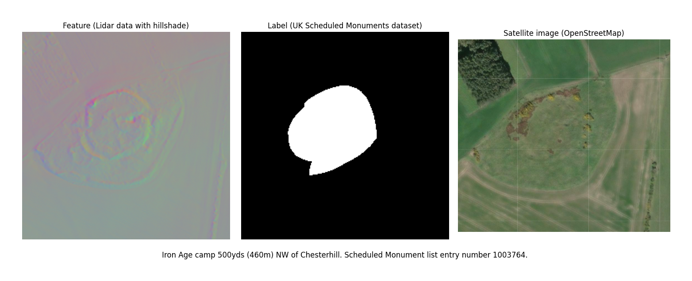
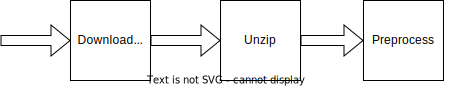

# Lidar.nn

## _Discovering ancient sites from UK Lidar data_

This repo contains a suite of tools used for training an image segmentation model on UK Lidar data with the aim of detecting archaeological features in the landscape not readily visible in satellite imagery.

### The data



#### Features

The [UK National Lidar Programme](https://www.data.gov.uk/dataset/f0db0249-f17b-4036-9e65-309148c97ce4/national-lidar-programme) provides 1m-resolution digital terrain mdoel (DTM) elevation data across a large fraction of the UK with this data made available by DEFRA. One of the key features of DTM data is that it provides the elevation of terrain and so can highlight features hidden beneath forests and vegetation. Such data [has been utilised](https://www.science.org/content/article/laser-mapping-reveals-oldest-amazonian-cities-built-2500-years-ago) in regions of dense forest canopy to identify sites of historic or archaeological significance.

The raw data consists of around 400GB across over 5000 tiles, each tile covering a 5km x 5km square in the [British National Grid System](https://britishnationalgrid.uk/) system, eg. `NY11se`.

Each tile folder contains a `.tif` which is the data we asre interested in, between 50-100MB in size.

```
lidarnn_raw/LIDAR-DTM-1m-2022-NY11se/
|-- index/
|-- lidar_used_in_merging_process/
|-- SP52sw-DTM-1m.tif
|-- SP52sw-DTM-1m.tif.xml
`-- SP52sw-DTM-1m.tfw
```

We can anticipate that absolute elevation data will be less useful to the model than gradient data, as the features we are trying to extract will be shallow bumps relative to the surrounding terrain, so in the preprocessing step we apply a hillshade algorithm which helps to normalise the data.

#### Labels

The [Historic England Scheduled Monuments](]https://opendata-historicengland.hub.arcgis.com/datasets/historicengland::national-heritage-list-for-england-nhle/explore?layer=6&location52.175175%2C-2.574311%2C6.61) dataset covers close to 20,000 scheduled monuments across the UK. Examples include Roman-era sites, barrows and tumuli, castles, earthworks, and the remains of ancient villages. Each element of this dataset consists of a detailed polygon tracing the perimeter of the feature which makes it an excellent candidate for use as a training label as it precisely masks the geographical features that the Lidar data gives us access to.

### The model

Our task is to build and train a neural network model that given an input image based on Lidar data, can output a binary mask that segments the image into areas containing archaeological features. The first model architecture we will apply will be the [U-Net](https://arxiv.org/abs/1505.04597) architecture, first developed for biomedical image segmentation.

The model can be found in `model/unet.py`

### The code

#### Data pipeline

The scripts under `data/` perform the bulk of data aquisition and preprocessing.

- `data/lidar_downloader.py` SFTP interface (using [`paramiko`](https://www.paramiko.org/)) for connecting to the DEFRA ftp server, listing contents and downloading data in smaller chunks. For this to work, see [How To Run](#How-to-Run).

- `data/lidar_helper.py` Helper functions for processing Lidar data into model-ready features. Uses [`rasterio`](https://rasterio.readthedocs.io/en/stable/) and [`geopandas`](https://geopandas.org/en/stable/).

- `data/lidar_plan.py` manages processing pipeline asynchronously using task queues shared between multiple processes. This helps speed up overall work, as well as being able to run the pipeline on smaller chunks for testing before scaling up.



- `data/synthetic_data.py` Utility for creating synthetic features using real masks with noise. Not a great model for real Lidar data, but handy for verifying model convergence and sanity.

- `util/data_loading.py` Implementation of pytorch Dataset class for accessing the features and labels. This file contains both an implementation of `LidarDataset` and `LidarDatasetSynthetic`. This means we can swap

#### Model

- `model/unet.py` Implementation of U-Net using pytorch.

#### Training

_[Under construction]_

- `train.py` [_TODO_] Helper functions for training
- `train.ipynb` [_TODO_] Notebook for running training + visualisation

## Results

_[Under construction]_

## How to run

If you want to run this code yourself, you will need to download the following data:

1. [UK National Lidar Programme](https://www.data.gov.uk/dataset/f0db0249-f17b-4036-9e65-309148c97ce4/national-lidar-programme). Refer to the link for download options. If downloading via sftp, create the following file in the project root named `sftpconfig.json`:

```json
{
  "SFTP_USER": "",
  "SFTP_HOST": "",
  "SFTP_PASSWORD": "",
  "SFTP_REMOTE_DIRECTORY": ""
}
```

2. [Historic England Scheduled Monuments](]https://opendata-historicengland.hub.arcgis.com/datasets/historicengland::national-heritage-list-for-england-nhle/explore?layer=6&location=52.175175%2C-2.574311%2C6.6) Extract to `{SHAPE_PATH}/monuments/` such that this file exists `{SHAPE_PATH}/monuments/Scheduled_monuments.shp`.
3. [UK boundaries](https://statistics.ukdataservice.ac.uk/dataset/2011-census-geography-boundaries-great-britain). This is used to mask out the sea on tiles straddling the coastline. Extract to `{SHAPE_PATH}/gb/`.

### Run full data pipeline

```python
from data.lidar_plan import DataPipeline
from data.lidar_downloader import list_files

# Run this the first time - it lists the contents of all DTM files on the remote
# server and saves it to ./ls.txt. This file is subsequently used to manage the task queue.
list_files('sftpconfig.json', 'ls.txt')

pipeline = DataPipeline(
        data_raw_path = RAW_PATH, # location .zip files will be downloaded to
        data_out_path = OUT_PATH, # location preprocessed features and masks will be places
        shape_path = SHAPE_PATH,   # location that the monuments and UK boundaries datasets extracted to
        remote_ls_file = 'ls.txt'
    )

# Run entire pipeline on first 500 items. By default it will spin up 1 process for downloading,
# 1 for unzipping, and 2 for preprocessing
pipeline.run(N=500)
```

See the `if __name__=='__main__'` section of `data/lidar_plan.py` for example usage
